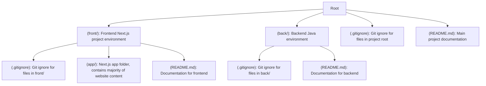

# F.C.R _Fast Car Rentals_

> CSUN COMP 380 Project | Abhishek Verma

**Group Members**

- Andrew Goldman
- Jack Mechem
- Jen
- Roark

    
<h2>Links</h2>

## Project Links

- [Jira](https://jack-mechem.atlassian.net/?continue=https%3A%2F%2Fjack-mechem.atlassian.net%2Fwelcome%2Fsoftware%3FprojectId%3D10000&atlOrigin=eyJpIjoiM2M3NDZkZDAzYTEwNGUwMThmZDQ2MzIyY2UyZTBjNGIiLCJwIjoiamlyYS1zb2Z0d2FyZSJ9)
- [Figma](https://www.figma.com/team_invite/redeem/nPJ156OfSjArJ9x80XV3CR?t=B5Q6Gqp3QpAIy14Y-21)

## Tutorial Links

- [Git/Github Crash Course](https://www.youtube.com/watch?v=mAFoROnOfHs)

## Project Description

### Prompt

A software that lets customers perform car rental online. Some functions of the software include logging in,
searching for a car, adding to cart, book, view booking, canceling, staff managing car pickup and return, and
generating some type of reports for the managers related to sales volume etc. The confirmation should be sent
to the customer via email. Optionally system lets customers leave a review.

### Tech Stack (subject to change)

#### Front End

- Framework: Next.js
- Styling: Tailwind CSS
- Package Manager: npm

#### Back End

- Language: Java
- UI Libraries/Frameworks: Undecided

## Project Structure

> :warning: **Subject to change**

## Contributions

_Note: Pushing changes directly to the main branch is disabled. Push your changes into a feature branch and create a pull request_

1. _Fork the repo if you don't have write access to the repo_
2. Create a feature branch
3. Push changes
4. Create a pull request
5. Have someone review your changes
6. Merge changes into main
